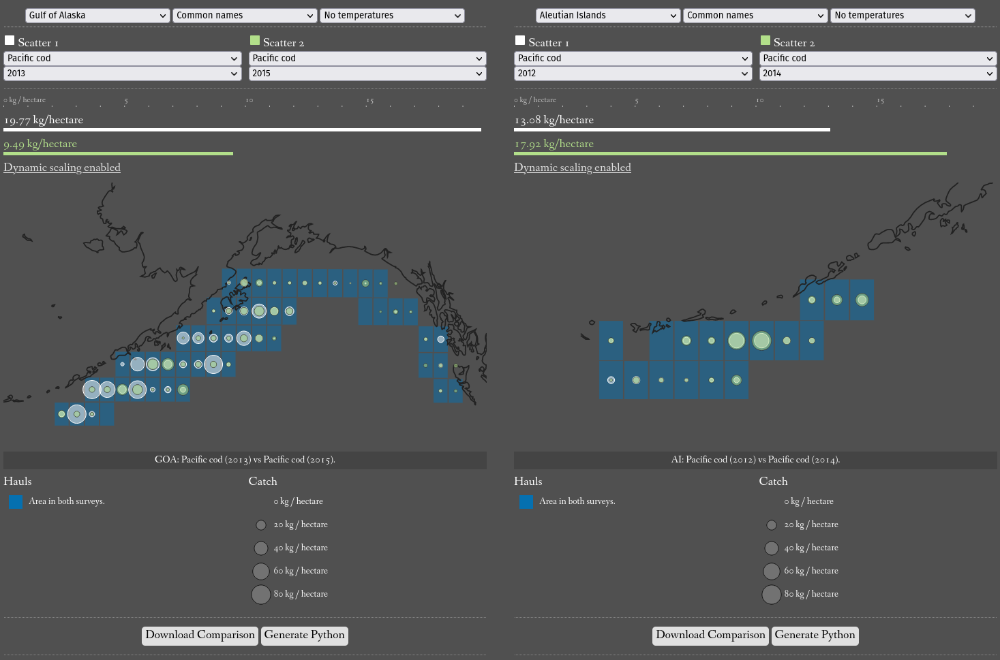

# Summary
The Resource Assessment and Conservation Engineering Division of the National Oceanic and Atmospheric Administration's Alaska Fisheries Science Center (NOAA AFSC RACE) runs the [Groundfish Assessment Program](https://www.fisheries.noaa.gov/contact/groundfish-assessment-program) which produces longitudinal catch data via bottom trawl surveys [@afscgap]. These "hauls" report where species are found and in what quantities, empowering ocean health research and fisheries management [@example]. Increasing accessibility of these important data (RACEBASE) through a suite of tools for individuals of diverse programming experience, Pyafscgap.org offers not just easier access to the REST API through ORDS compilation but provides both memory-efficient algorithms for "zero-catch inference" and interactive visual analytics tools [@inport; @ords]. Altogether, this toolset supports investigatory tasks not easily executable using the API service alone and, leveraging game and information design, offers these data to a broader audience.

# Statement of need
Pyafscgap.org reduces barriers for use of GAP data, offering open source solutions for addressing the dataset's presence-only nature, use of proprietary databases, and size / complexity [@inport].

## Developer needs
The `afscgap` package offers easier developer access to the official REST service with automated pagination, query language compilation, and documented types. Together, these tools enable Python developers to use familiar patterns to interact with these data like type checking, standard documentation, and other Python data-related libraries while freeing programs from structures specific to closed-source Oracle REST Data Services (ORDS) [@ords].

That being said, access to the API alone cannot support some investigations as the API provides "presence-only" data [@inport]. Many types of analysis (like geohash-aggregated species catch per unit effort) require information not just about where a species was present but also where it was not [@geohash]. In other words, while the presence-only dataset may provide a total weight or count, the total area swept for a region may not necessarily be easily available but required [@notebook]. The `afscgap` Python package can, with memory efficiency in sometimes millions of data points, algorithmically infer those needed "zero catch" records.

## General public needs
Though the `afscgap` Python package makes GAP catch data more accessible to developers, the size and complexity of this dataset requires non-trivial engineering for comparative analysis between species, years, and/or geographic areas [@notebook]. Therefore, this project also offers visualization tools sitting on top of `afscgap` to begin investigations. Employing information and game design, this tool lowers usability barriers to address audiences of broad technical sophistication. Furthermore, it offers both Python code generation as a bridge to `afscgap` and CSV export for those at home in other tools.

# Functions
This project's design aims to improve accessibility of NOAA AFSC GAP catch data, democratizing developer access to the sophisticated methods required to interact with these data and offering inclusive approachable tools to kickstart analysis.

## Lazy querying facade
Starting with the `afscgap` library, lazy "generator iterables" increase accessibility of the data by encapsulating logic for memory-efficient pagination and "data munging" behind a familiar interface [@lazy]. Furthermore, to support zero catch data, decorators adapt diverse structures to common interfaces to free client code from understanding the full complexities of `afscgap`'s type system [@decorators].

![Diagram of simplified afscgap operation [@diagrams].\label{fig:library}](library.png)

Finally, offering a single function entry-point into the library with keywords for complex use, this "facade" approach allows the user to interact with these systems without requiring client code to reflect deep understanding of the library's mechanics, a goal furthered by compilation of "standard" Python types to Oracle REST Data Service queries [@facade].

## Zero catch inference
"Negative" or "zero catch" uses the following:

 - Paginate while records remain available from the API service.
   - Record species and hauls observed from API-returned results.
   - Return records as available.
 - Generate inferred records after API exhaustion.
   - For each species observed in API results, check if it had a record for each haul in a hauls flat file [@flatfile].
   - For any hauls without the species, produce an 0 catch record from the iterator.

Note that, in adddition to compiling Python types to ORDS queries, those queries are also emulated in Python to filter inferred records.

## Visualization
Despite these developer-focused tools, zero catch inference can expand this dataset into the millions, demanding technical sophistication to navigate. To further increase accessibility, this project offers visualization tools for temporal, spatial, and species comparisons.

However, building competency in sophisticated interfaces presents user experience challenges and, to that end, this project interprets Hayashida level design via Mark Brown's formalization into an in-tool introduction sequence that directs the player through a "real" analysis [@hayashida; @brown]:

 - **Introduction**: The player sees information about Pacific cod with pre-filled elements used to achieve that analysis gradually fading in.
 - **Development**: The tool invites the player using the mechanics introduced moments prior to change the analysis to compare different regions with temperature data.
 - **Twist**: Overlays on the same display are enabled, allowing the player to leverage mechanics they just exercised in a now more complex interface.
 - **Conclusion**: The tool ends by giving the player an opportunity to demonstrate all of the skills acquired in a new problem.

Finally, while this interface uses game / information design techniques to offer an accessible on-ramp to quickly learn a sophisticated interface, it is also designed as a starting point for continued analysis by generating either CSV or Python code to "take out" work into other tools. Examined via Thinking-aloud Method [@thinkaloud].

## Limitations
This library focuses on single threaded non-asynchoronous utilization and  visualization recognizes that aggregation of hauls happens on a latitude / longitude point due to dataset limitations which may cause some approximation in regional CPUE as documented in the visualization's README [@readme].

# Acknowledgements
Thank you Carl Boettiger and Fernando Perez for advice in the library. Thanks also to Maya Weltman-Fahs, Brookie Guzder-Williams, and Magali de Bruyn for advice on visualizations. Project of the The Eric and Wendy Schmidt Center for Data Science and the Environment at University of California Berkeley where Kevin Koy is Executive Director. Though the project lists full library credits in its README, authors want to thank runtime dependencies ColorBrewer, D3, Flask, Geolib, Requests, Toolz, and Papa Parse [@colorbrewer; @d3; @flask; @geolib; @requests; @toolz; @papa].

# References